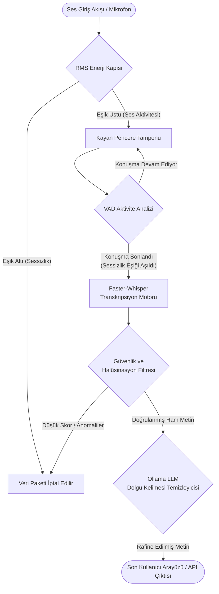

# Kurumsal Düzey Gerçek Zamanlı Türkçe STT (Speech-to-Text) Mimarisi

Bu proje, bankacılık, finans ve müşteri hizmetleri gibi yüksek doğruluk ile düşük gecikme oranlarının kritik önem taşıdığı kurumsal alanlar için özel olarak optimize edilmiş, gerçek zamanlı (real-time) bir Türkçe Konuşmadan Metne (STT) dönüştürme sistemidir.

## Standart OpenAI Whisper Modeli ile Geliştirilen Mimari Arasındaki Yapısal Farklar

[Standart OpenAI Whisper](https://github.com/openai/whisper) modeli şüphesiz sektör standartlarını belirleyen bir yapay zeka harikasıdır. Ancak mimari tasarımı gereği **gerçek zamanlı akış (real-time streaming)** işleme yeteneğinden ziyade, **statik ve yığın bazlı ses dosyası analizi (batch processing)** üzerine kurgulanmıştır.

Geliştirilen bu sistem, standart Whisper modelinin akustik başarımını temel alırken; alt yapısında **CTranslate2** destekli `faster-whisper` motorunu barındırmakta ve kurumsal kullanıma uygun, özel olarak geliştirilmiş bir **dinamik akış (streaming) mimarisi** ile entegre çalışmaktadır.

**Temel Ayrıştırıcı Özellikler:**
1. **Kesintisiz Gerçek Zamanlı Akış:** Ses verisi statik bir dosya olarak beklenmez. Sistem kesintisiz dinleme gerçekleştirir, kelimeleri anlık olarak işler ve VAD (Voice Activity Detection - Ses Aktivite Tespiti) algoritmaları sayesinde cümlenin sonlandığını otomatik olarak tespit eder.
2. **Sıfır Halüsinasyon Stratejisi:** Geleneksel Whisper modelleri, sessizlik anlarında veya yüksek gürültülü ortamlarda ("İzlediğiniz için teşekkürler", "Altyazı" vb.) halüsinasyon olarak tabir edilen sahte çıktılar üretmeye meyillidir. Geliştirilen özel filtreleme katmanı sayesinde bu tür anlamsız çıktılar tamamen engellenmektedir.
3. **Akıllı Metin Temizleme (Filler Removal):** Ollama yerel büyük dil modeli (LLM) entegrasyonu kullanılarak, konuşmacının doğal düşünme süreçlerinde ürettiği *"eee"*, *"hmm"*, *"ııı"* gibi dolgu kelimeleri, cümlenin anlamsal bütünlüğü bozulmadan temizlenir ve kurumsal raporlamaya uygun, rafine edilmiş bir metin elde edilir. Bu özellik isteğe bağlı (opsiyonel) olup, konfigürasyon dosyasından kapatılması durumunda ağ ve yerel LLM çıkarım gecikmeleri ortadan kalkarak sistemin toplam işlem hızı yaklaşık 2 katına (2x) çıkmaktadır.

## Teknik Karşılaştırma Matrisi

| Kriter / Metrik | Standart OpenAI Whisper | Geliştirilen STT Mimarisi |
| :--- | :--- | :--- |
| **İşlem Paradigması** | Dosya Tabanlı / Statik (Batch) | Kayan Pencere Tabanlı / Dinamik (Streaming) |
| **Çıkarım Hızı (Inference)** | 1x (Referans Süre) | **~4x Daha Hızlı** (CTranslate2 Optimizasyonu) |
| **Bellek Tüketimi (VRAM)** | Oldukça Yüksek (FP16/FP32) | **Optimize Edilmiş Düşük Tüketim** (INT8/FLOAT16 Quantization) |
| **Sessizlik Yönetimi** | Doğrudan Desteklenmez | **Gelişmiş VAD + RMS Enerji Kapısı** (Gereksiz GPU Tüketimini Önler) |
| **Halüsinasyon Engelleme** | Bulunmamaktadır | **Sektörel Türkçe & Bankacılık Odaklı Filtre** |
| **Dolgu Kelimesi Temizleme**| Bulunmamaktadır | **Ollama LLM Entegrasyonu ile Mevcuttur (Opsiyonel / Pasifken ~2x Hız Artışı)** |
| **Operasyonel Maliyet** | Yüksek Donanım Gereksinimi | GPU Dostu, Ölçeklenebilir ve Düşük Maliyetli |

---

## Yapılandırma ve Parametreler (`config.py`)

Sistemin esnekliği, detaylı parametre ayarları sayesinde sağlanmaktadır. Aşağıda `config.py` dosyasında yer alan temel parametre sınıflarının kod parçaları ve açıklamaları yer almaktadır.

### 1. Model ve Ses Ayarları

```python
    # ── Model ──────────────────────────────────────────────────
    whisper_model: str = "large-v3"
    device: str = "cuda"
    compute_type: str = "float16"

    # ── Ses ────────────────────────────────────────────────────
    sample_rate: int = 16000
    chunk_duration_s: float = 1.5  # Düşük gecikme için 1s (eskiden 1.5)
    max_buffer_s: float = 8.0  # Kayan pencere sınırı (8s → maks ~800ms işlem süresi)
    energy_threshold: float = 0.005  # RMS enerji kapısı
    end_of_speech_s: float = 1.2  # Konuşma sonu sessizlik eşiği (saniye)
    max_speech_s: float = 8.0  # Kesintisiz konuşma sınırı → zorla transkript et
    force_transcription_on_max_speech: bool = False
```
- **whisper_model, device, compute_type:** Kullanılacak modelin boyutunu (örn. `large-v3`), donanımı (CPU/CUDA) ve veri tipini (FP16/INT8) belirler. Hassasiyet ve hız dengesini kurar.
- **max_buffer_s & chunk_duration_s:** Gerçek zamanlı akışın kayan pencere (sliding window) boyutlarını belirler. Ses ne kadar süre biriktirilecek ve Whisper'a gönderilecektir.
- **energy_threshold & end_of_speech_s:** Sessizliği tespit etmek için kullanılır. RMS enerjisi belirli bir eşiğin altındaysa boş ses sayılır; bu sessizlik `end_of_speech_s` kadar sürerse cümle bitti kabul edilir.
- **max_speech_s & force_transcription:** Kullanıcı hiç susmadan çok uzun süre konuşursa sistemi kilitlememesi adına belirli bir saniyede çevirinin zorla yapılmasını sağlar.

### 2. Whisper Çıkarım ve Güvenlik Ayarları

```python
    # ── Whisper Ayarları ───────────────────────────────────────
    beam_size: int = 16  # Maksimum hız için 1 (Greedy decoding). 5 çok yavaştır.
    temperature: float = 0.0  # Deterministik çıktı
    language: str = "tr"
    vad_filter: bool = True
    vad_min_silence_ms: int = 600  # VAD sessizlik eşiği
    word_timestamps: bool = True  # Hizalama zorunluluğu → halüsinasyon azaltır
    suppress_blank: bool = True  # Boş token bastırma
    condition_on_previous_text: bool = False  # Geri besleme döngüsünü kır
    initial_prompt: str = BANKING_INITIAL_PROMPT
```
- **beam_size & temperature:** Modelin farklı ihtimalleri (beam) değerlendirme sayısını belirler. Deterministik, yani hep aynı doğru sonucu vermesi için `temperature` 0 tutulur.
- **vad_filter & vad_min_silence_ms:** Modelin kendi içindeki Ses Aktivite filtresini yapılandırır. Fısıltı ve nefes seslerini konuşma sanmasını engeller.
- **word_timestamps & condition_on_previous_text:** Önceki metinden koşullanmayı devre dışı bırakarak ve kelime düzeyinde zaman damgası zorunluluğu getirerek modelin halüsinasyon görmesini teknik seviyede engeller.
- **initial_prompt:** Modele bankacılık terminolojisini (havale, EFT, IBAN vb.) önceden vererek bu kelimeleri daha doğru tanımasını sağlar.

### 3. Güven Eşikleri ve Dolgu Kelimesi Temizliği

```python
    # ── Güven Eşikleri ─────────────────────────────────────────
    no_speech_threshold: float = 0.3  # Sıkı (eskiden 0.5)
    avg_logprob_threshold: float = -0.7  # Bankacılık için sıkı
    compression_ratio_max: float = 2.0  # Tekrarlı döngüleri yakala
    accept_confidence: float = 0.80  # ≥ 0.75 → ACCEPTED
    low_confidence_min: float = 0.50  # 0.50-0.74 → LOW_CONFIDENCE, < 0.50 → REJECTED

    # ── Ollama Dolgu Kelimesi (Filler) Temizleme ───────────────
    use_ollama: bool = False
    ollama_url: str = "http://localhost:11434/api/generate"
    ollama_model: str = "qwen3.5:0.8b"
```
- **Güven Eşikleri:** Whisper'ın ürettiği olasılık (logprob), konuşmasızlık (no_speech) ve sıkıştırma oranı (compression) değerlerine matematiksel kısıtlar koyar. Düşük güven değerlerine sahip çıktılar reddedilir (REJECTED) veya uyarılı iletilir (LOW_CONFIDENCE).
- **use_ollama & ollama_model:** Yerel ağda koşan Ollama servisinin özelliklerini tanımlar. Bu özellik opsiyonel olup; aktif edildiğinde metin üzerindeki dolgu kelimeleri temizlenir. Devre dışı bırakılması durumunda, ağ ve çıkarım gecikmesi bypass edilerek sistem performansı yaklaşık 2 katına (2x) çıkmaktadır.

---

## Sistem Akış Mimarisi (Topoloji)

Sistemin bir ses dalgasını işleyerek anlamlı ve rafine edilmiş bir metne dönüştürme yaşam döngüsü aşağıdaki şemada ifade edilmiştir:



---

## Yüksek Ölçeklenebilirlik Stratejisi (100.000+ Eşzamanlı Kullanıcı)

Sistem mevcut haliyle tekil sunucu mimarisinde yüksek verim sağlamaktadır. Ancak yüz binlerce eşzamanlı aktif kullanıcının bulunduğu üretim (production) ortamlarına taşınması için aşağıdaki dağıtık mimari prensipleri benimsenmelidir:

1. **Uç Nokta Bilişimi (Edge Computing) ile Ön Filtreleme:**
   - VAD ve Enerji Kapısı analizlerinin tamamı sunucu yerine son kullanıcının cihazında (Mobil uygulama veya WebAssembly aracılığıyla web tarayıcısında) gerçekleştirilmelidir.
   - Bu sayede sunucuya kesintisiz ses gönderilmesi engellenir; yalnızca anlamlı konuşma içeren 2-3 saniyelik veri paketleri iletilerek sunucu maliyetlerinde %70'e varan oranda optimizasyon sağlanır.

2. **Düşük Gecikmeli İletişim Protokolleri:**
   - İstemci ile sunucu arasındaki veri aktarımı, geleneksel ve yük getiren HTTP protokolleri yerine çift yönlü, akışkan haberleşme imkanı sunan **gRPC** veya **WebSockets** protokolleri üzerinden sağlanmalıdır.

3. **Yatay Ölçekleme ve Orkestrasyon (Kubernetes):**
   - STT iş yüklerini üstlenen servisler (Workers) konteyner mimarisine (Docker) dönüştürülmeli ve **Kubernetes** ortamında konuşlandırılmalıdır.
   - Trafik yoğunluğuna bağlı olarak Horizontal Pod Autoscaling (HPA) mekanizması ile sunucu (Pod) sayısı dinamik olarak artırılıp azaltılmalıdır.

4. **Kuyruk Yönetimi ve GPU Dinamik Yığınlama (Dynamic Batching):**
   - Eşzamanlı gelen on binlerce ses paketi doğrudan işleme alınmak yerine **Kafka** veya **RabbitMQ** gibi sağlam bir mesajlaşma kuyruğuna aktarılır.
   - STT servisleri, **NVIDIA Triton Inference Server** kullanılarak kuyruktaki bağımsız ses paketlerini saniyelik olarak yığınlar (batch) halinde birleştirir. Bu işlem, GPU'nun tekil işlemler yerine tam kapasite (100% Utilization) ile çalışmasını sağlayarak saniyede binlerce kullanıcının talebine aynı anda yanıt üretmesine olanak tanır.

---

## Gelecek Sürüm Hedefleri ve Gelişim Yol Haritası

### 🔊 Yapay Zeka Destekli Arka Plan Gürültü İptali (AI Noise Cancellation)
Sistemin çağrı merkezleri, yoğun ofis alanları veya dış mekanlar gibi yüksek gürültülü ortamlarda kullanılması durumunda klavye sesleri, uğultular veya dış konuşmalar transkripsiyon kalitesini olumsuz etkileyebilmektedir. Gelecek mimari güncellemesinde, ses sinyali STT motoruna iletilmeden hemen önce derin öğrenme tabanlı bir akustik filtreleme (Örn: **DeepFilterNet** veya **RNNoise**) modülünden geçirilecektir. Bu ön işleme adımı sayesinde girdi sesinin stüdyo kalitesine yaklaştırılması ve modelin doğruluğunun ekstrem koşullarda bile maksimum seviyede tutulması hedeflenmektedir.

---

> [!NOTE]  
> **Sektörel Uyumluluk Notu:**  
> Geliştirilen bu mimari yalnızca bankacılık sektörü ile sınırlı değildir. Konfigürasyon dosyasındaki (`config.py`) `initial_prompt` (ön yönlendirme metni) parametresi ilgili sektörün terminolojisine göre (sağlık, hukuk, e-ticaret, lojistik vb.) güncellenerek, sistem kolaylıkla her türlü iş koluna ve farklı terminolojilere adapte edilebilir.
